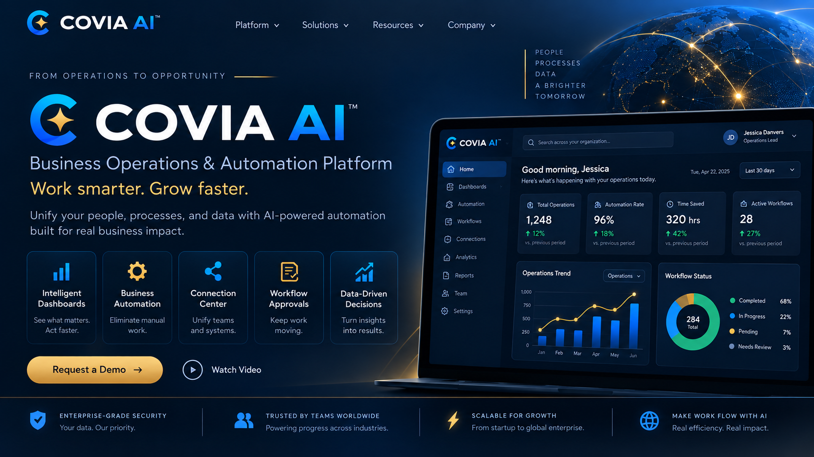
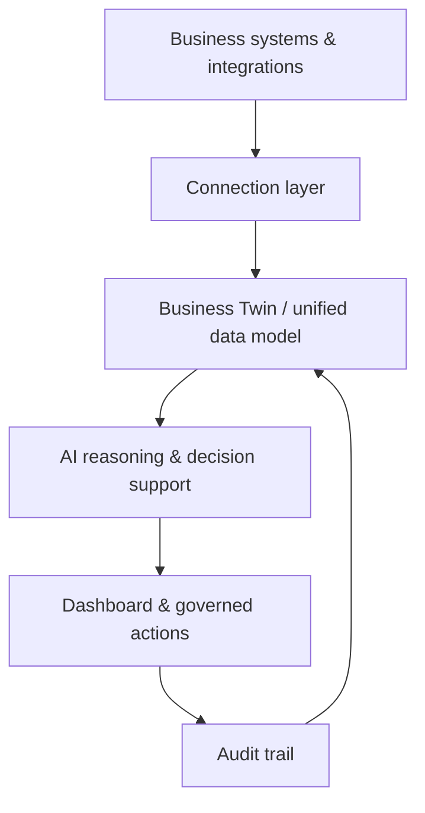

  

*Portfolio visualization — public case study; production implementation remains private*

# Covia AI

### Business Operations & Automation Platform

**Portfolio status:** Public case study · Production implementation remains private

Covia AI is an intelligent operating layer for small and midsize businesses. It is designed to bring business data, daily briefings, decision support, workflow approvals, and governed automation into one operating experience.

## Business problem

Many businesses operate across disconnected systems for customers, sales, finance, inventory, email, reporting and daily operations. That fragmentation slows decisions and makes it difficult to see what needs attention.

Covia AI is designed to create one operating view where a business can understand what is happening and take controlled action.

## My role

I designed the product direction and implementation workflow around a **Business Twin**, unified dashboard, daily briefing, connection layer, decision support and governed automation.

## Selected capabilities

- Authentication and role-based access
- Unified business dashboard
- Daily operational briefing
- Business Twin data model
- Customer, sales, finance, inventory and employee views
- Connection center for external services
- Email workspace and approval-based send workflow
- AI-assisted decision support
- Governed automation
- Audit trail for important actions

## Architecture

## Automation model

Covia AI follows a controlled progression:

Sensitive or destructive actions remain approval-based until the workflow is proven reliable and observable.

## Engineering principles

- Human approval for sensitive actions
- Auditability before autonomy
- Clear separation between data, reasoning and execution
- Modular integrations
- Secure credential handling
- Database-backed verification of important actions
- Production systems kept private

## Technical focus

React · TypeScript · APIs · databases · authentication · role-based access · email workflows · cloud deployment · GitHub delivery · AI-assisted automation

## Public portfolio boundary

This repository does **not** contain production credentials, customer data, private infrastructure, proprietary prompts, internal AI services, or live environment configuration.

---

**Shadova AI** — AI-powered business systems, automation, cloud applications and digital products.